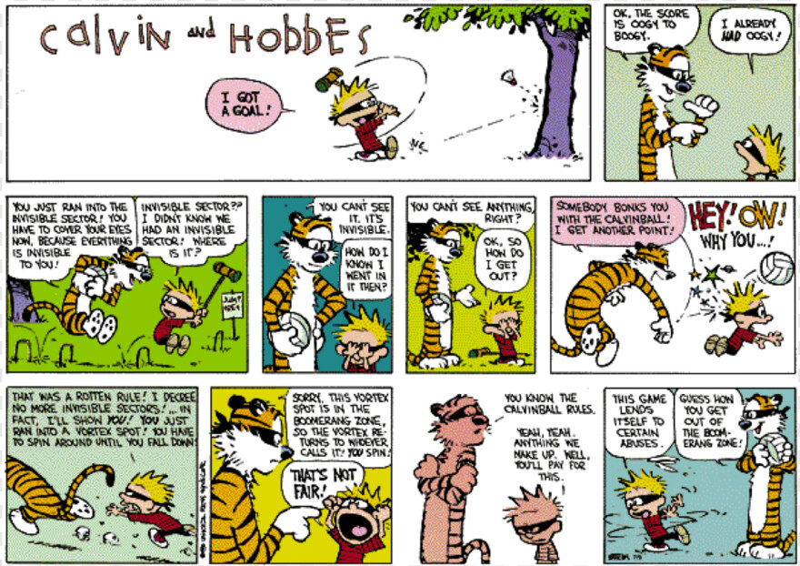
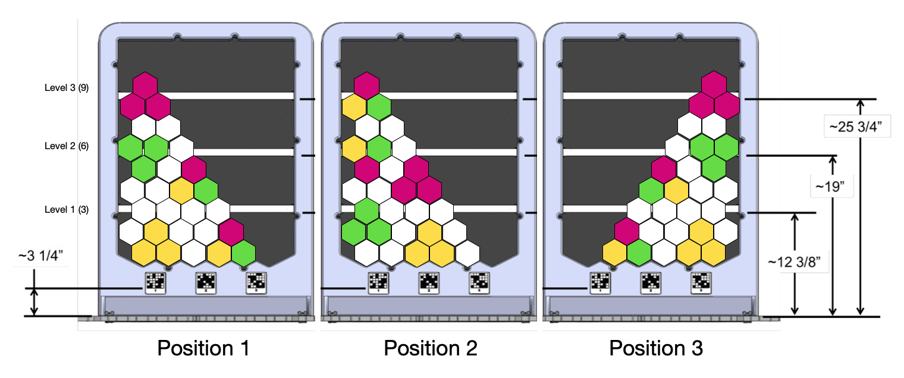
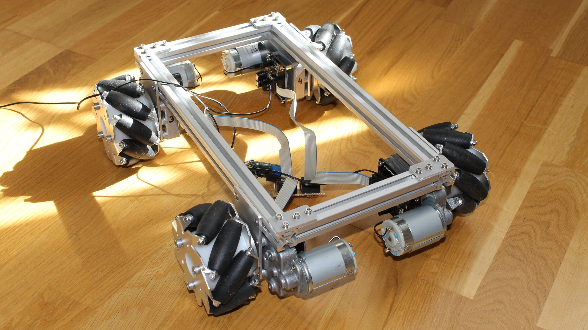
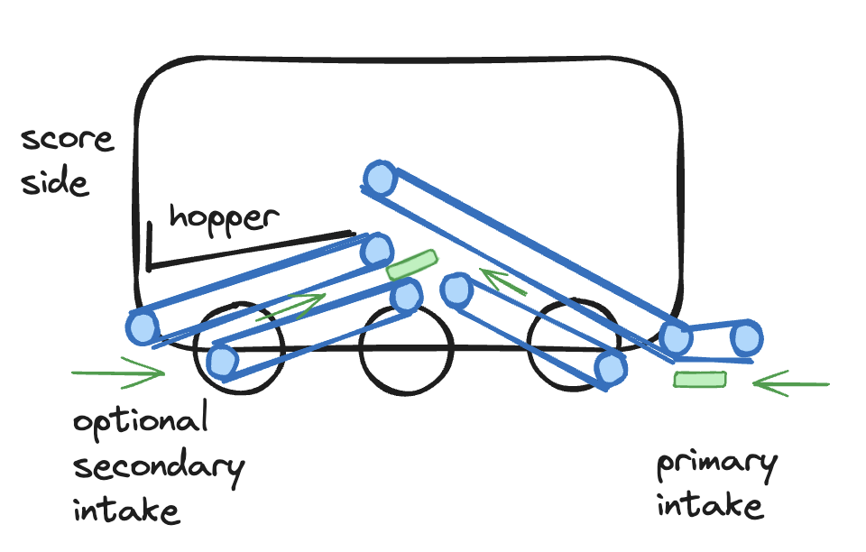
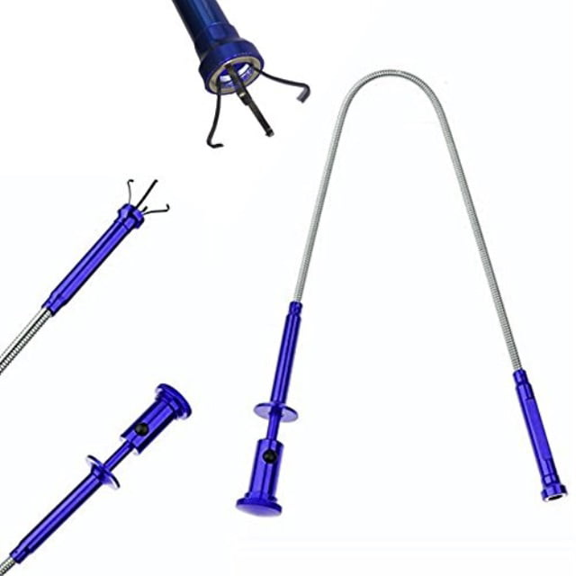
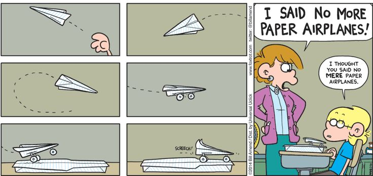
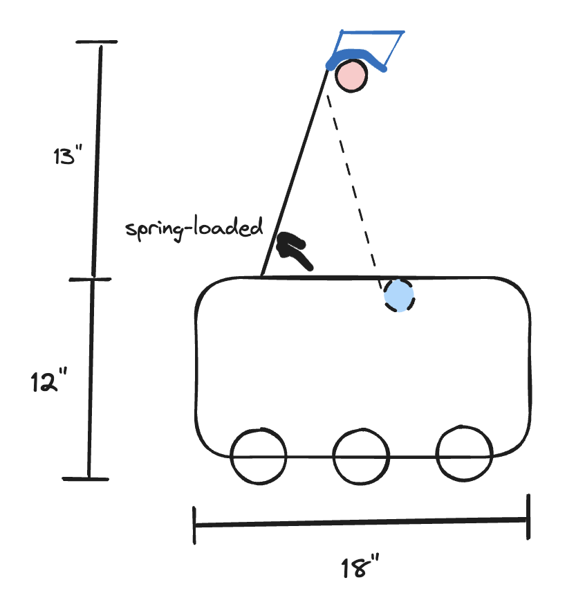

Field setup for 2023-2024 FTC game. Image credit: FIRST

In 8th grade, much to the credit of my dad, I started competing in [FIRST Tech Challenge (FTC)](https://www.firstinspires.org/robotics/ftc) as a home team with my older brother and a church friend. Even as one of the scrappiest teams around (we ran out of screws at our first tournament and made the coolest but jankiest two-stage scissor lift to grace the NorCal FTC scene), it is one of the seasons I look back at most fondly. My dad and I reminisce often about, when we left the regional championship that year, how excited I was to start the next season, despite our robot completely falling apart during the competition. Because of FTC, I found my passion in engineering, specifically computer science, and it is through FTC that I built a lot of my initial hands-on technical and interpersonal skills. Perhaps one day I will make a follow-up post on some of the things I learned? I have so many stories from those 5 years that I never get the chance to share these days except with the robot nerds I meet at tournaments a couple times a year, so this could be a fun outlet for those.

It has been 12.5 years since my first season (I can't believe I am that old 🤪), over which I competed in FTC for 5 years and am now in my fifth year of volunteering in FTC as a referee/judge. Now that I can no longer compete, volunteering has been one of the highlights of my season every year. I love seeing the designs teams come up with and their execution on their ideas (some better than anything I could make, even now!). I love how much they are seeking to do for their community, and I love seeing how excited the kids get when they are talking about their robot or team or all the ways they have overcome the challenges facing their season.

That being said, I have always wished I could go back and compete again myself, as there is so much I miss about the thrill of designing, building, and piloting your robot on the field (all nighters not included). For those who are engrossed in the community, you probably know about "FRC in 3 Days" or "FTC in 1 weekend", which many teams (official and alumni alike) now use as a hackathon-style way to start the season and help teams with initial design ideas and prototyping. Since graduating from high school though, I have never had the garage space, tools, or money (or friends? 😅) to pull something like this myself. However, now having this platform, I thought it would be a fun idea to start doing an "FTC in 3 Hours", in which instead of actually building a prototype robot, I would just focus on game analysis and design to come up with what I think will be the winning strategy (or strategies) and design of the season. Time permitting, it would be a lot of fun to come up with a CAD design as well, but I may have to resort to pencil-and-paper drawings. If anyone actually reads any of these ever, especially any teams actually competing, I hope that the focus would be not on the actual designs I come up with but how I systematically approach a problem like this. There will always be factors that I am not considering here (e.g. team resourcing, technical skills within the team and mentors - know your limits!), but I am also a believer in the idea that if you don't set your sights on, or at least know, what your most ideal target is, then you are putting a ceiling on what you can achieve from the very outset.

(I realize also that this will help me be a better referee at tournaments. As a student, you always assume that the referees are the most knowledgeable about the game (which they are 😉), but in reality I spend 1 hour a year reading up on the rules compared to the students spending months engrossed in the game, so I've always felt a bit underprepared going into refereeing personally.)

With that all said, let's get designing!

# Game Analysis

If you have never heard of FIRST Tech Challenge before, I encourage you to check out 
[their website](https://www.firstinspires.org) to learn more about their suite of four programs. If you are not 
familiar with this year's FTC game, watch the animated video below!

<iframe width="560" height="315" src="https://www.youtube.com/embed/6e-5Uo1dRic?si=5xbqzV3YqqarSq0c" title="YouTube video player" frameborder="0" allow="accelerometer; clipboard-write; encrypted-media; gyroscope; picture-in-picture; web-share" allowfullscreen></iframe>

The first critical part of approaching an FTC challenge is to understand the scoring and rules. It is easy to just see 
the game challenge video and fixate on obvious strategies, but I find it critical to take the time to read the rules 
carefully.

## Scoring

FIRST conveniently provides a nice scoring summary in their manual, which I have summarized and augmented here:

| Task                                    | Phase   | Unit Pts | Quantity | Max     |
|-----------------------------------------|---------|----------|----------|---------|
| Robot parked in backstage               | Auto    |        5 |    1 / 2 |  5 / 10 |
| Pixel in backdrop                       | Auto    |        5 |  16 / 17 | 80 / 85 |
| Pixel in backstage                      | Auto    |        3 |  16 / 17 | 48 / 51 |
| Purple pixel on spike mark              | Auto    |       10 |    1 / 2 | 10 / 20 |
| Purple pixel on spike mark w/ team prop | Auto    |       20 |    1 / 2 | 20 / 40 |
| Yellow pixel on backdrop                | Auto    |       10 |    1 / 2 | 10 / 20 |
| Yellow pixel on backdrop w/ team prop   | Auto    |       20 |    1 / 2 | 20 / 40 |
| Pixel in backdrop                       | Tele-op |        3 |       47 |     141 |
| Pixel in backstage                      | Tele-op |        1 |       47 |      47 |
| Mosaic bonus                            | Tele-op |       10 |        5 |      50 |
| Set bonus                               | Tele-op |       10 |        3 |      30 |
| Robot suspended from rigging            | Endgame |       20 |    1 / 2 | 20 / 40 |
| Robot in backstage                      | Endgame |        5 |    1 / 2 | 10 / 20 |
| Drone launch: zone 1                    | Endgame |       30 |    1 / 2 | 30 / 60 |
| Drone launch: zone 2                    | Endgame |       20 |    1 / 2 | 20 / 40 |
| Drone launch: zone 3                    | Endgame |       10 |    1 / 2 | 10 / 20 |

**Autonomous total**: 125 / 175

**Tele-op total**: 221

**Endgame total**: 50 / 100

**Match total**: 396 / 496

Some useful calculations:
* Autonomous
  * Pixel scoring on the backdrop: 80% of the max score
  * No pixel scoring in autonomous (other than pre-loaded): 80% of the max score
  * Number of tele-op pixel scores to offset autonomous scores: 7 per auto pixel (4 cycles)
* Tele-op:
  * Number of backstage pixels to offset backdrop: 3 (3:1 cycle ratio)
  * Number of mosaics vs. set bonus: 1 mosaic per set bonus
  * Number of pixel scores to offset set and mosaic bonuses: 4 (2 cycles)
  * Minimum number of pixels per set bonus:
    * level 1: 5 on edge / 6 in middle (height of 3)
    * level 2: 12 on edge / 21 in middle (height of 6)
    * level 3: 29 on edge (height of 9)
* Endgame:
  * Drone launch: 7.6% of max score
  * Number of pixel scores to offset drone launch: 10 (5 cycles)
  * Robot rigging: 5% of max score
  * Number of pixel scores to offset rigging: 7 (4 cycles)

In summary, we make the following conclusions:
* Strategy
  * The vast majority of points are in pixel scoring, even if we assume that most of the on-field pixels will not be 
    scored during autonomous.
  * Given the number of cycles required to offset these, it is a given that a top tier robot will have a strong auto 
    (everything short of scoring additional pixels), a drone launch, and rigging capabilities.
  * Building in the ability for autonomous pixel collection and scoring will be important for late season performance.
* Tactics
  * In a time crunch, a consistent drone launch which can score in zones 1 or 2 is as good or better than rigging (and 
    being able to setup for both might be the most consistent).
  * All else equal, it is more optimal to score pixels in mosaic and set bonus arrangements, but such a strategy must 
    be compared to the 2-cycle time.
  * Having a reliable straight-line auto + park for a 33% chance to score 20 points is a must for early season, in case 
    for whatever reason the ideal auto stops working.

Some caveats to this table:
* While the game is one of two alliances, certain tasks will need to be performed by both robots to get the maximum 
  amount of points, which you cannot necessarily factor into design. For this reason, we are going to perform the 
  calculation both in the situation where you have only 1 robot and where you have 2. There are a couple of tasks which 
  are technically possible by one robot, e.g. if you pick up their own pixel off the ground, but let us for now ignore 
  that in the score calculations.
* This table assumes that you do not take any of the pixels on the opposing alliance's side, e.g. those in the stacks 
  already on the field after tele-op.

## Rules

A lot of the rules do stay the same from year to year, so I want to highlight the main ones that I think will be most 
critical to shaping gameplay:
* G02: score certification occurs at the end of the match, so as long as the robot is lifted above the ground at the 
  time of the buzzer, it does not need to remain suspended
* G08: there are certain elements of the playing field (namely the truss) where tolerances could conceivably come into 
  play, so margins should be built into the overall height of the robot and the height needed to reach in order to lift.
* GS05: You can hold up to two pixels at a time
* GS06: Robot can only grasp the rigging of their corresponding truss but may contact other parts for stability
* GS08: Robots cannot be in tiles in rows 1, 2, or 3 and score in the backstage or backdrop
* GS10: pixels may not be propelled
* GS11: the drone must be launched over a rigging or the top pole of the stage door

### Poking the Rules

Some of the most successful robots come from realizing the hidden strategies in between the rules that others didn't see. Image credit: Calvin and Hobbes, Bill Watterson

Now that we have enumerated the important rules, we want to see if we can poke the boundaries of what these rules allow 
for us. Some generic questions I would ask include
* **What are some relevant dimensions of the field?**
  * Backdrop:
    * 6 to 7 pixels in each row (alternating)
    * 3 rows to reach each level (11 or 12 maximum)
    * The width is approximately a single tile, while the top of the board is 20.125" in height at a 30° angle
    * Parallel to the board, the 11th pixel center is 29.75" from the ground
  * Landing zone
    * 144" wide (i.e. field width) and 24 inches deep each
    * The wall is approximately 12" high
  * Rigging
    * The rigging is 23.5" to the top, with a 1.3125" outer diameter
    * The horizontal bar near the rigging is about 14" high
    * The gap between vertical supports is at minimum 21.5"
    * The height of the stage door ranges from 12" to 26"
    * (The horizontal distance from the rigging to the yellow support is not given in the game manual but should be 
      measured)
* **What is the maximum number of game elements that can be scored?**
  * Assuming the opposing team does not fumble their pixels, there are
    * 6 stacks of 5 white pixels on the field, including 3 on each side
    * 3 stacks of 5 white pixels in the pixel storage and 2 additional in storage or on the field
    * 1 stack of 5 purple pixels in the pixel storage, of which up to 2 can be preloaded
    * 1 stack of 5 yellow pixels in the pixel storage, of which up to 2 can be preloaded
    * 1 stack of 5 green pixels in the pixel storage
    * In practice, a total of 47-62 pixels can be scored
  * 1 drone per robot (note that a robot cannot possess the drone of another alliance)
* **What game elements is the robot allowed to use? What game elements are alliance-specific, and what is up for grabs**
  **by any alliance?**
  * After the autonomous period, any of the pixels on the ground are fair game, including those on the opposing alliance's side
* **Are there game elements that can be scored in unconvential ways?**
  * Pixels by and large are constrained to a particular cycle of scoring.
  * Drones must be flown over the truss but can be scored while hanging from the rigging.
* **How far can the robot be in order to be in a scoring position? What parts of the robot need to be where in order**
  **to be in a valid scoring position?**
  * Pixels: robot must be in tile rows 4 through 6
  * Drone: must go over the truss
  * Rigging: must not be supported by the ground when the buzzer sounds
* **Where, or how far, can the human player deliver game elements? How far can the robot deliver game elements?**
  * The robot cannot throw pixels
  * The robot must throw the drone over the truss
* **Where is interference allowed or disallowed in the game?**
  * A robot cannot prevent access to the wing but could make it harder to take a particular route
* **How much can be performed in the autonomous period prior to tele-op start, and can anything be double counted?**
  * All scoring of pixels is valid and will be double scored in autonomous and tele-op (5 points in auto). However, auto
    scoring would only include the yellow pixel and any white pixels scored from the field (max 15).
* **How stable are various scoring areas of the field?**
  * The backdrop is particularly unstable. It seems like it will be fairly easy to knock pixels off the board or shift 
    the locations of the pixels

With that, here are some notable observations:
* Robot dimensions
  * The mechanism used to score pixels should be able to reach a length of 30" parallel to the board, or ~20" vertically
  * The robot should be able to fold to under 12" so as to pass comfortably under the stage door.
* Pixel scoring
  * Scoring 2 pixels at a time is essential for having efficient scoring cycles
  * Scoring as many pixels during autonomous is ideal
  * The maximum reasonable cycles which a robot should be able to perform is roughly 24 in a match.
  * Being able to pick up pixels from the ground or a stack quickly is essential for scoring, not limited to those 
    placed in a specific arrangement in the wing
  * The mechanism for scoring pixels should result in as little disturbance to the backdrop as possible
* End game
  * Drone and hanging time can be minimized by making it easy to position or having the alignment be the same
  * Ideally, the robot should be able to approach the rigging from either side to hang

# Strategy

We are now ready to formulate our plan for how we want to approach the game. We will want to think about how the 
maximum amount of points one can score breaks down into different tasks as well as the plausibility of tasks when 
thinking about how long a task will take, although at the same time we want to leave robot design out as much as 
possible. For the latter part, I am particularly considering strategies which yield fewer points per action but for 
which the actions can be carried out very quickly, though with most of the recent FTC games, there are often caps on 
maximum points that make those strategies sub-optimal in the end.

We break up our strategy into the tasks the robot will complete and how they will be carried out in the game itself.

## Game Strategy

The plan for our robot will be as follows:
* Autonomous
  * Score the purple pixel on the appropriate strike mark
  * Score the yellow pixel in the appropriate location onto the backdrop
  * Score additional white pixels from the field onto the backdrop
  * Park in the backstage
* Tele-op
  * Score white pixels from the field onto the backdrop
  * Score additional pixels from the wing onto the backdrop
* Endgame
  * Launch the drone into the landing zone
  * Hang from the rigging

Thus, the robot should be able to perform the following tasks:
* Navigation
  * Navigate *autonomously* to the spike mark with the team prop
  * Navigate *autonomously* to a white pixel stack on the playing field
  * Navigate *autonomously* to a white pixel on the playing field (ideal)
  * Navigate *autonomously* (under the rigging) to the backdrop
  * Navigate *autonomously* (under the rigging) to the backstage
  * Navigate under the stage door and rigging
  * Navigate to the wing
  * Navigate to align with the backdrop
  * Navigate over pixels without pushing them
* Identification
  * Identify *autonomously* the discrete location of the team prop
  * Identify *autonomously* the location of the spike mark with the team prop
  * Identify *autonomously* the location of a white pixel stack on the playing field (ideal)
  * Identify *autonomously* the location of a white pixel on the playing field (ideal)
  * Identify *autonomously* the location on the backdrop corresponding to the designated spike mark
  * Identify *autonomously* the location on the backdrop at which to play a set of pixels (ideal)
* Pixel tasks
  * Place *autonomously* a pixel on the ground on the designated spike mark
  * Collect \[*autonomously*\] a pixel from the ground in any position and orientation
    * Note: being able to collect pixels from either side may be advantageous, as this will allow for easy collection 
    of pixels which are in the backstage or have fallen off the backdrop.
  * Collect \[*autonomously*\] a pixel from a pixel stack
  * Collect a pixel from the wing
  * Store 2 pixels in the robot
  * Place \[*autonomously*\] a pixel on the backdrop
  * Place \[*autonomously*\] 2 pixels on the backdrop
  * Place \[*autonomously*\] a pixel in the backstage (ideal)
  * Push a pixel in a directed fashion (ideal; in case a mechanism breaks)
* Drone tasks
  * Launch the drone into the landing zone from the field
  * Launch the drone into the landing zone from the rigging (ideal)
* Hanging tasks
  * Hang on the rigging

## Game Tactics

For the purposes of this blog post, game tactics are less important for us, but I wanted to put a few notes here to 
keep in mind (especially for late-season strategy):
* Autonomous
  * The autonomous programs of the two robots need to work in concert with one another, and thus which could factor 
    into the design of the autonomous program and sensors. The interactions could happen
    at a couple places:
    * One robot could score the yellow/purple pixels of the other robot
    * Both robots may opt to score their own yellow pixels on the backdrop
    * Both robots may opt to park
    * One or both robots may opt to score white pixels from the field, which could result in them occupying the same 
      space as the other
  * It would be particularly interesting to have the robot be able to analyze the backdrop state and know 
    autonomatically where to place pixels.
* Tele-op
  * It is best to have one person be the shot-caller (likely the coach or the human player) as to what pixels get placed 
  when and where. The challenge for scoring mosaics and line bonuses is that the pixels may need to be placed in a 
  particular way to ensure that mosaics are built properly and optimally. Some specific notes:
    * While the positions of a mosaic are critical, the colors are only restricted once one is already on the board. To 
      that end, the human player should be in charge of selecting the colors. If it makes it easier, mosaics can always 
      just be created by choosing all distinct colors each time.
    * The importance of a shot-caller is more critical if the maximum number of pixels which can be scored is lower, as 
      that will require more careful optimization of where mosaics are placed and how they are built up to maximize the 
      height on the backdrop. If neither of these objectives are important to the strategy, then a shot caller is not 
      necessary.
    * In practice, the more your coach can think big-picture strategy, the better. You should practice arrangements 
      (you could even do it as humans playing the game) under timed scenarios where the drivers can make
    the micro decisions around how the pixels are placed, and then just trust your drivers to know.
  * For placing pixels, it is most optimal to start on one edge and build from the corner, as in order to reach the 
    third set bonus you will need to build from one of the edges anyway, and you won't have enough pixels to build each 
    level fully. It would be useful to test the stability of such an arrangement with the actual setup.
  * Because the backdrop is so unstable, having a reliable partner who will not knock them off or change the arrangement 
    is key. This will be very hard to control in qualifying matches. The solution should **not** be to tell your partner 
    not to score on the backdrop, because that is not fun for your partner, so you will need to 
    think carefully about how to optimize this well and scout this out during qualifying matches.
  * When only white pixels are necessary, picking up the ones on the ground is easier than collecting from the wing.
  * The more operations which can be performed autonomously, the better.
  * In most cases, the robot should almost always be able to score two at a time, but occasionally it may be more 
    optimal to be able to score only 1. This hypothesis should be evaluated further and considered in design. If only 
    one of these is implementable, it is likely more preferable to be able to just score two.
* End game
  * Minimizing the time it takes to line up to launch the drone is important. This could include either making it so that 
    the alignment to the rigging and to scoring the drone are the same, or making it so that the drone has a wide 
    tolerance from where it can be launched

Example of optimal scoring arrangements for each auto randomization to minimize pixels required and maximize mosaic and set bonuses (note: height not to scale, but assume 3 rows needed per set).

See the above image for an example of what an optimal arrangement may be that your team targets during a game. This 
arrangement only requires 14 white pixels, which is notable in that the driver will need to know when to go to the wing 
and when to pull from the field. With a good auto, this arrangement will look very different, given that the number of 
white pixels one can score before deviating from this is pretty small. That being said, scoring more pixels is only 
better, especially considering that you should have enough space for the other mosaics anyway. This at least proves that 
it is possible to get every bonus with only 29 pixels, or 14 cycles not including the first one in autonomous. Note 
also that the colors can be permuted within the guidelines of the rules, except for the mono-yellow mosaic, which must 
be scored as such to maximize points due to the autonomous bonus. While it would be simpler to just build five 3-color 
mosaics, it will work if only one of the autonomous pixels can be placed.

# Robot Design

Now that we have decided on our robot strategy, let's talk about the actual mechanisms which will be needed on the robot:
* Drivetrain
* Sensors and autonomous routines
* Pixel collector
* Pixel hopper
* Pixel backdrop scorer
* Drone launcher
* Hanging mechanism

Below, I will enumerate some thoughts as to how I would design the robot. In most teams' circumstances, especially as
you will likely have a couple months before your first scrimmage, I would recommend doing a comprehensive brainstorming,
research of existing ideas, mathematical analysis, prototyping, and CAD to design each component. Since I don't have 
that kind of time here, I am primarily going to leverage my prior experience to hypothesize what would work well, up
to maybe a few ideas. In practice, there will definitely be ideas that work in my head but not in practice, so I would 
always recommend trying things out! But for the sake of this post, we are in the land of theory, and in the land of 
theory everything works.

> "In theory, theory and practice are the same. In practice, they are not." - Albert Einstein (in theory)

## Drivetrain

In this year's game, there is nothing special we need to worry about in designing a drivetrain. The main challenges
we need to concern ourselves with are aligning to drive under the rigging (fairly trivial with any drivetrain) and 
aligning to the backdrop, which may involve some horizontal alignment. For the most part, there aren't tasks that require
a lot of spinning back and forth on the field for these challenges either.

Now I have to put an obligatory rant here about mecanum wheels, which were pretty rarely used in my seasons of FTC but
have become commonplace on almost every robot in modern designs. In my seasons, defense was a much more viable strategy
due to the nature of the rules and the challenges, which allowed for or encouraged more robot-to-robot interaction.
Furthermore, while omniwheels were reasonably prevalent, it is a bit harder to design a drivetrain around them, and 
mecanum wheels were not frequently used and expensive to purchase. Nowadays, though, with the expansion of part availability
and game rules which largely discourage defensive plays (especially this year), mecanum wheels are commonplace for 
allowing for omnidirectional motion on the field, while allowing for wheels to still be mounted in the same arrangement
as standard wheels.

Who uses these abominations, and why can't I get them on my car?? Seriously, you do not want to see me try to parallel park. Image credit from patentyogi.com.

My hot take 🔥: mecanum wheels are overrated and abused by most teams who don't know how to use them properly:
* Most teams slap them on their robot without truly evaluating their benefits and drawbacks. In my few times judging
  teams over the last 5 years, I don't know that I have ever seen a team document a legitimate analysis of why they chose
  mecanum wheels over standard wheels.
* The real power in omnidirectional drives is not just allowing for strafing motion, but that you can actually combine 
  the vector motions (forward, strafing, and rotation) to move in any direction on the field and at any rate of rotation.
  The math is worth learning though more complicated than a standard drive, and the sensors needed to truly pull it off
  (i.e. for field-centric control) are non-trivial, which is likely a major contributor to why most teams don't achieve
  this level of control. That being said, it is 100% worth learning and will put a team above the others in terms of navigation.
* Mecanums are deceptively easy to use. While more experienced teams can build drivetrains well and have practice with 
  their robots (hopefully), teams which are starting out may have more issues building a proper drivetrain with level 
  wheels and appropriate weight distribution. These kinds of mistakes can punish a team more than if they used a standard 
  drivetrain, without them understanding why their robot does not drive well. In a challenge like this, just being able 
  to move is critical to performing any sort of task in the game, and building a mecanum drive requires more precision 
  in design.
* While not relevant in this game, terrain navigation is hard with mecanum wheels, and they don't scale as well in
  size.
* At least in my day and age, mecanum wheels were expensive, and you need to have replacements when using a more complex
  wheel. Of all aspects of the robot I would prioritize, mecanum wheels is probably not one of them unless time is more
  at a premium than money.

This all being said, I don't think it is wrong to use them, but I think a majority of the teams that do are not getting 
as much value from them as they would like to believe, and for some they can even be a detriment. In games like these, 
I think the best teams will win regardless of whether they use a standard or omnidirectional drive, with proper practice 
and design.

For this particular design and challenge, either would work, but for the sake of the following design, let's assume
that a standard 2n-wheel drive is used (probably 6 wheels is optimal, but 4 would also work).

The other aspect of this worth mentioning is that while low clearance is generally good, we would like it so that our
robot can drive over pixels without pushing them, as it will hinder our cycle times if the driver needs to avoid any pixel 
on the ground while moving around. Thus, while having the ability to herd them by pushing is nice, it would be better
to be able to pass over them seamlessly. We should also ensure that, if we end up driving over one, that it does not
hinder motion around the field.

## Autonomous routines

As stated previously, we want to automate the following tasks for both autonomous and tele-op:
* Navigate *autonomously* to the spike mark with the team prop
  * This could be implemented with odometry and path finding or by using computer vision applied to the team prop and/or white tape.
    The exact position would depend on where the purple pixel is placed relative to the robot.
* Navigate *autonomously* to a white pixel stack on the playing field
  * We could use odometry and path finding to navigate the robot to the right area, combined with vision to move the robot
    to the pixel stack itself. Since the stacks are at fixed locations, we could just assume their location, but if the
    stack is knocked over or disturbed, the mechanical design will need to be robust enough to find them, or else vision
    will be useful for robustness of detection.
* Navigate *autonomously* to a white pixel on the playing field (ideal)
  * For this, we will assume that the camera is within view of a pixel, since there is no global knowledge of all pixel
    locations at a given time. We can then use the same methods as before to move the robot in position to ingest the
    pixels.
* Navigate *autonomously* (under the rigging) to the backdrop
  * This can be accomplished with odometry and path finding, but ideally for smoother motion, having a sensor such as
    a camera to help make sure the robot does not bump into the walls would be ideal. The odometry should be from a 
    wheel module independent of the robot's active wheels, in case it gets nudged in the wrong direction. The walls
    could also be used to orient the robot to the rigging opening closest to the wall, but it will make for a more 
    efficient autonomous to not need to use it.
  * To approach the backdrop without knocking it over, it would be useful to have a proximity sensor at the bottom of 
    the robot or otherwise use a camera to detect the distance and deccelerate the robot.
  * Odometry or vision could likewise be used to get the robot into the general vicinity of the backdrop. To align with 
    the specific location at which the robot wants to score would require fairly precise positioning. This could be done 
    with a camera perhaps, suing the backboard shape or the AprilTags, though would be probably the most challenging of 
    vision tasks.
  * For a greater challenge and better autonomous, using the camera for obstacle avoidance and path planning would be 
    especially interesting
* Navigate *autonomously* (under the rigging) to the backstage
  * Same requirements and solutions as the backstage, but less stringent in terms of robot positioning relative to the 
    backdrop
* Identify *autonomously* the discrete location of the team prop
  * This should be relatively easy with vision, since we can design the team prop to be very clearly visible and only
    need to classify its location to one of three discrete categories.
* Identify *autonomously* the location of the spike mark with the team prop
  * This could be done using path finding, since the marks are at fixed locations. We could also use a light sensor or
  camera to find the marks.
* Identify *autonomously* the location of a white pixel stack on the playing field (ideal)
  * This could just be assumed, or otherwise performed using vision.
* Identify *autonomously* the location of a white pixel on the playing field (ideal)
  * This could just be assumed, or otherwise performed using vision.
* Identify *autonomously* the location on the backdrop corresponding to the designated spike mark
  * We could use the AprilTags for this, or as long as we can locate the backdrop relative to the robot, we can just 
  move the robot to a predetermined location relative to the backdrop
* Identify *autonomously* the location on the backdrop at which to play a set of pixels (ideal)
  * The main challenge with this is being able to identify the existing arrangement of pixels, and then to have an 
    algorithm for determining where to place the next pixels. The main challenge here would be to identify each pixel 
    already on the board. To build the algorithm for optimizing pixel placement, we could do anything from building a 
    simple heuristic model to building a model which can optimize the reward. 
  * Alternatively, to start we could just place the pixels anywhere on the board, since it may not matter for autonomous 
    to be especially precise.
* Place *autonomously* a pixel on the ground on the designated spike mark
  * The easiest here would be to just raise the mechanism to a specified height. As long as the robot is reasonably centered
    in front of the backdrop and is at the right proximity, as detected by an optical, vision, or touch sensor, then the
    robot should be able to place the pixel.
  * A more sophisticated setup would figure out the right height to place the pixel, which would require either knowing 
    the existing pixel configuration and using preset heights or detecting exactly the heightest pixels with a sensor
    mounted on the mechanism.
* Collect \[*autonomously*\] a pixel from the ground in any position and orientation
  * Vision would probably be used to move the robot into position to collect the pixel. The intake mechanism should be
    designed as a touch-and-grab design, i.e. it should be able to intake the pixel from many different positions or angles
    and instantly grab it the moment it makes contact.
  * We would need to design the system to only intake up to two pixels. Having a sensor near the intake which counts 
    each collected pixel would suffice for this.
* Collect \[*autonomously*\] a pixel from a pixel stack
  * The challenge here is ensuring that the stack is not disturbed, or otherwise being flexible with collecting the pixels
    even if the stack has fallen. This would ultimately just require experimentation of the physics of how the stack 
    behaves with certain intake mechanisms, but designing with flexibility in mind (i.e. the stack falling should not 
    hinder the robot's ability to collect pixels) would be optimal.
* Place \[*autonomously*\] a pixel on the backdrop
  * The mechanism should be designed to allow for relatively imprecise movements. The more tolerance that can be built 
    into the design while keeping the motion variables as simple as possible, the better.
* Place \[*autonomously*\] 2 pixels on the backdrop
  * This is the same as 1 pixel, for all intensive purposes.
* Place \[*autonomously*\] a pixel in the backstage (ideal)
  * This is relatively easy given everything we have already talked about, since we already know how to navigate to the
    backstage and can pretty easily repurpose an existing mechanism to just deposit the pixel in the backstage.

To summarize, these are the algorithms we would want to support and sensors we would need:
* **Sensors**
  * *Odometry + IMU* - this would be used for navigation between points on the field
  * *Camera* - we would need one pointing in the direction of the collection mechanism and one in the direction of the 
    scoring mechanism. We could also just swivel a single camera to look in both directions, though it may be easier to 
    have fixed cameras on each side if the electronics allow.
  * *Optical intake sensor* to detect pixels being ingested (within mechanism)
  * *Optical backdrop sensor* at the bottom of the robot, facing forward in the direction of the backdrop, to detect the 
    backboard
  * (Optional: an optical or touch sensor on the scoring mechanism to detect when the pixels are against the backboard
     sufficiently to be scored)
  * (Optional: an optical sensor for identifying lines on the ground)
  * An assortment of limit switches or encoders would likely be useful for various mechanisms to move to preset positions
* **Algorithms**
  * Navigating to a particular location on the field (general pathfinding algorithm using odometry)
    * Navigating to a spike mark (pathfinding)
    * Navigating to white pixel stack (pathfinding for general movement + camera for pixel detection)
    * Navigating around rigging (pathfinding for general movement + possibly camera for structure detection)
    * Navigating to backboard (pathfinding for general movement + camera for alignment + optical sensor for detecting 
      near distance to board)
    * Navigating to backstage (pathfinding for general movement + optional optical line sensor)
  * Identifying the spike mark of the team prop (camera)
  * Identifying pixels (camera)
  * Intaking a pixel (camera, optical intake sensor)
  * Identify where to score pixel on backdrop (camera using AprilTags + camera identifying current pixels on board)
  * Place pixel on the backdrop (optional optical scoring sensor to detect pixels near scoring mechanism and/or limit 
    sensor to determine when contact with backdrop has been made + encoders to move mechanisms)
  * Place pixel on spike mark or backstage (reverse intake to deposit pixel)

Note that these autonomous routines should be reusable within tele-op. Especially given the fragility of the pixels
on the backdrop, relying on sensors to align the robot would be much preferred to manual control for some of the 
sub-routines. The cycles either need to be automated for achieving precision quickly, or the mechanisms need to be robust 
and flexible enough to allow for low precision.

While some of these ideas may carry over from past seasons or be implementable from libraries, a lot of these components
would take a while to implement and test. You do **not** need a robot for all of this though, so I would get started on
the vision parts as soon as possible and potentially also build a push bot just for autonomous routine testing. You could
also develop a lot of the fundamental ideas in the off-season, as even without knowing the game you could guess at least
some of these algorithms would be useful.

## Pixel mechanisms

The pixel mechanism as a whole consists of the intake, the hopper (storage), and the scoring mechanism. We describe
primarily the intuition for the intake and scoring mechanisms below, as the hopper will just adapt in design to whatever
the needs are for the other components.

### Intake

For the intake mechanism, we consider the following properties:
* We want the intake mechanism to be a touch-and-grab. As explained earlier, that means that the intake should effectively
  "control" the pixel as soon as it makes contact with it. Having to wait for the pixel or fidget with the robot position
  in order to grab the pixel makes it harder to collect during auto and tele-op, especially when the driver cannot see.
* Less required precision is better, as it will make positioning the robot easier to collect pixels.
* The robot should be able to reach pixels in any position. That includes pixels against the wall or a corner, pixels in 
  a stack, or pixels propped up at a slant on other pixels or objects.
* Having an intake on the correct side(s) of the robot will minimize unnecessary movement. In our case, the collecting 
  and scoring areas are on opposite sides of the field, so there definitely should be an intake on the opposite side 
  of the scoring mechanism. It likely will also be useful to have an intake on the other side as well.

There are a lot of intake designs online that are battle tested in FTC and FRC, including designs based on wheels, rollers, 
surgical tubing, and so on. The only way to know what would really work is to test different designs with the actual
game pieces. I would for sure avoid any solutions that involve grabbing the pixels with a claw, arm, or other similar mechanism,
as these often require precise positioning to grab the pixels. While guards can help settle the pixels into the correct
location, note that these solutions tend not to work once pixels are pushed against the wall and also require the robot
to approach the pixels very slowly. The less careful we have to be, the better. Personally, I would look into a double
roller design, similar to how FRC robots picked up frisbees in 2013. It is slightly harder here since the pixels don't
have rounded edges, but in theory it should work similarly. Otherwise, intakes similar to cilia, like surgical tubing,
may be effective given the hole and ridges in the pixels.

As a last note, in order to achieve complete ground clearance, you may need the intake to extend out and retract in some
form. You'll need it anyway in order to reach pixels in the tighter spaces.

Example of dual-side intake design using rollers (optical sensors shown in red). We could opt to use a single-sided 
belt with gravity on the top instead of dual conveyor belts, but double rollers just makes the whole setup more controlled 
at the cost of space and complexity. You would probably want to test both designs and CAD it out to see how much 
real-estate you really have. Also, nothing is drawn to proportion so this definitely would not fly, but the concept is 
reasonably battle tested. The width is also not shown, but technically it does not need to be full robot width for the 
entire conveyor system.

### Scoring Mechanism

For the scoring mechanism, we require the following:
* We want to minimize the amount of mechanism that surrounds the pixels, so that we don't have to leave a large space
  in between the pixels being scored and the ones already scored. This will allow for more precise placement and less 
  likelihood of knocking other pixels down
* The pixels should already be oriented with one vertex facing downward, so that it will mesh easily with the
  existing pixels
* The release mechanism should have a low profile to prevent knocking the backdrop or other pixels
* The scoring mechanism should be see-through to make it easier for the drivers to see the pixels
* The entire design should fit within 12" height. That is a pretty difficult task considering that it needs to extend 
  up to 30".
* Ideally, in order to place both pixels simultaneously, the scoring mechanism could rotate the pixels in 60° increments 
  to score them in one of three configurations (adjacent, diagonal, or anti-diagonal).
* Ideally, the mechanism could release only one pixel at a time.
* Ideally, the mechanism would have some spring-like flexibility such that it can absorb some shock in contacting the backdrop
  and provide some robustness against positioning error (angle-wise)

To hold the pixels, this could either involve containing them in a tight, clear hopper with a bottom gate (though this 
wouldn't work especially well with a rotating design) or holding them through their centers, which would work well with
rotation but would require a clever design to hold them tightly without dropping them. I personally am more of a fan of 
playing around with designs that hold them by the centers, as this would give you the most fine-grained control and
rotational symmetry. You would effectively need one motor per pixel and a third to rotate the mechanism. The whole 
holder assembly should be mounted using fairly hard springs or a similar material to give it more leniency when scoring.
The angle it needs to flex to should be pretty small.

Example of a mini-claw tool. The mechanism we want to replicate is some single extension or motorized operation which 
causes a part to expand to fill the hole, and then when retracted automatically pulls out of the hole. There are also
ways to do this without springs, such as with a linkage-based design. Image credit: Walmart

Because it is hard to align the centers with free-form pixels, we want to use a robust intake to first collect the
pixels and then load the pixels into a hopper which can store them in a consistent configuration that can be picked up
by our mechanism.

For the extension mechanism, telescoping slides are always the simplest way to go in terms of operation. It should not
be underestimated how much work goes into building one (this is definitely a mechanism I would master building in the
off-season, given how frequently it is used). That being said, the main challenge here is staying under the 12" height 
limit. If you need about 1" clearance for pixels to pass underneath, in practice you have about 11" of vertical height.
At a 30° angle, that comes out to `11 * 2 / sqrt(3) = 12.7 in.` or so of height (in practice you won't be able to build 
to your absolute limit). You should hopefully only need 3 stages in the lift to reach the top, which is pretty 
reasonable, given also that most of the pixels won't be scored at the very top anyway (keep in mind that it is only
beneficial to score up to the 9th row in practice, and to fill all 9 rows such that you need to score on the 10th row
would require 58 pixels to be scored, which is more than half of the pixels and thus, with optimal placement, likely to
already secure you victory, if you could even score that many).

There is certainly a tradeoff in some of the above criteria between design simplicity and optimal placement, and for
what it is worth, my designs tend to be much more complicated and overengineered than they need to be 😅. This would all
need to be evaluated more carefully in prototypes to determine the differences in cycle time compared to the complexities
of the solutions, as there may be simpler designs (e.g. just dumping the pixels out of a hopper) which achieve sufficiently 
good precision for creating mosaics. Only testing will really tell what will work and what won't, and a precise design
will only work well if the drivers don't actually need to do more work to get more control.

## Drone Launcher

The drone launcher is pretty straightforward in design. Here are a few of the things I would personally test:
* How do different drone designs affect the flight pattern? Unlike your standard paper airplane, you actually want it
  to follow as close to a parabolic trajectory as possible. Gliding will likely make it harder to predictably get it to
  land in zone 1, since we really aren't aiming for distance.
* What materials work best for consistently launching the drone with the same speed? Rubber band-like materials are an
  obvious choice, but they may wear easily over time. Alternatives to spring mechanisms could include a flywheel, though
  it is a bit overkill for this. Modularity here to replace the spring or entire mechanism is important.

Most likely, I would recommend a spring-launching mechanism with a servo-initiated trigger, because it's probably not
worth overcomplicating this component, and I think you could implement this with sufficient reliability.

Whatever solution someone chooses, having backups due to wear and running a lot of testing is essential to having a 
consistent design. Quantitative analysis and experimental trials are a necessity for proving a good drone launching 
design.

Some student somewhere is going to get carried away with making all these airplanes. Hopefully someone pulls up to a
tournament with one that has wheels. Image credit: Foxtrot Comics

As one more aside, this part of the robot is fairly isolated and almost feels trivial, which in the early season will 
lead to many teams doing a last-minute, haphazard job of putting together a drone launcher. Do not be deceived! The fact
that it is simple means you should dedicate some real time to just doing it right, because 30 points in early season
is a sizable contribution to your team. In the first qualifying tournament, a lot of matches could have been swayed
just by having a reliable drone launcher. The fact that it only relies on having a drivetrain that can get you in 
position means it is worth devoting students and science to it so you can do it right and not worry about it.

## Hanging Mechanism

Given the number of hanging challenges in both FTC and FRC (e.g. FTC 2013-2014, 2015-2016, etc.), there are a plethora
of designs to use as inspiration here. Since the bar is not that high, one might consider extending out a hook with a 
winch for hanging (e.g. using a spring-loaded mechanism, a telescope, or a tape measure even). Passive hanging is also
possible (see ['Oly Cows design for Block Party](https://www.youtube.com/watch?v=hzv4aFclxc4) as an example). Some 
specifications for the design:
* Simple is better to manage weight and complexity, given everything else already going on in the design.
* The hang should be possible coming from either direction for either hanging spot on your alliance's side of the rigging.
  That means that either the mechanism should extend vertically, or it should have dual-sided hooks.
* You should consider where the hooks are located relative to the centroid of the robot. If the weight of the robot is
  off, then you will have to hang higher in order to get off the ground. Minimizing the lift time will be critical with
  last-minute scoring.
* Reuse of a mechanism can be beneficial for simplicity of design (e.g. reusing the same lift as is being used for pixel
  scoring). The reason for avoiding this would be to avoid single-point failures and put less stress on a single 
  mechanism, especially since a lift which needs to hold the robot's weight has more stringent requirements than one
  which is only required for pixel scoring. This is probably a reasonable way to go if the team feels confident enough
  in building a strong lift design.

Design-wise, I would personally test either a spring-loaded mechanism to rotate up a hook connected directly to a winch,
or I would use a passive mechanism (though space management might be hard for this). For a spring-loaded design, one
thing to be careful about is how strong the spring is, as a weak spring may result in the hook not being fully extended.
If margin is not built properly into the design, then it could result in the hook not quite reaching the rigging.

Passive mechanisms are cool on paper but require careful weight distribution and geometry. The idea is that, when the
hook is fully engaged, the robot should actually be suspended just above the ground. In order to engage it, the slant
of the hook needs to hit the rigging, causing the front end of the robot to lift off the ground while the back end
continues to drive it forward. Once the hook is engaged, the robot can reverse to lift the back wheels off the ground 
as well. As it might sound, it is definitely possible to execute but doubtless would require CAD designs and multiple 
iterations to get it right.

This could be either the start to a passive mechanism or a winch-based one. Because it is spring-loaded, the robot can
either pass under the yellow support bar of the truss first and then extend it or, if on the open side, just extend it
before approaching. For a winch-based design, the rope should be attached as close to the hook itself as possible to
minimize inefficient transfer of energy, and the winch should be mounted in alignment with the center of mass.

I didn't elect to talk a lot about practicing, but this is one part of the game that should be practiced in isolation.
To hazard a guess, the best teams should be able to complete the drone launch and hang in 10 seconds, starting from the 
backdrop, in late season while under pressure. This is also a mechanism you want to test and check thoroughly, as
any kind of fall these robots take usually spells some kind of shock damage (either to the robot or your mental; trust me,
I still can see our 2016 robot tumble down the RES-Q mountain from attempting a pull-up to this day).

# Concluding Thoughts

In the future, I would love to do CAD designs for these, but in practice I probably won't have that kind of time.
I might also do a season review at the end to see what the most successful designs were in the end and how far off I 
was!

If any of this piques your interest, then consider finding a school or local team to compete in (if you are in middle 
or high school), or sign up to volunteer or find a team to mentor! I have seen myself how much fun the students have 
and how much they learn through the program, and even if you do not have a technical background, you can probably 
still bless the kids so much with your talents.
