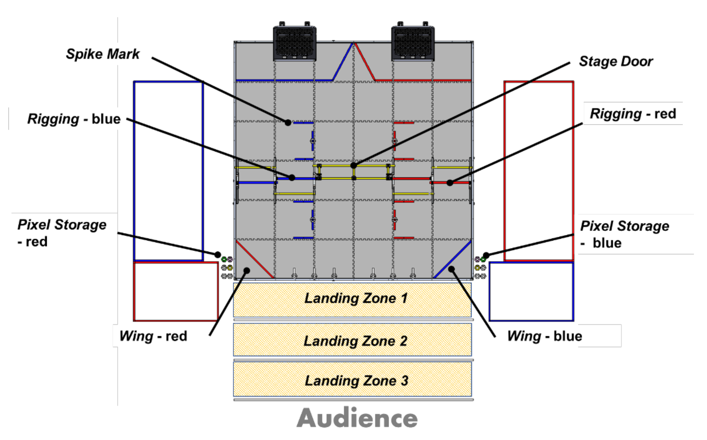

Field setup for 2023-2024 FTC game. Image credit: FIRST

Imagine if you could go back in time but that you couldn't change anything about the events from the past up to the 
present. What moment would you go back to?

I was first introduced to the short story collection, _Before the Coffee Gets Cold_ by Toshikazu Kawaguchi, a couple 
years ago by a friend from Boston. After coming up in various recommendations and conversations, I decided that I wanted 
to read it again. It is such a moving series of stories of love, honesty, growth, and living in faith and without 
regrets. My friend mentioned that she never got the chance to blog about her own thoughts on the book, and I felt 
compelled after my second time around to compile some thoughts in response to reading it.

For context, I won't spoil the plot, but the general premise of the book is a cafe that allows people to travel in time. 
However, there are many rules about the circumstances under which one can travel. The most important rules include
the following:
1. you will not be able to change any events that have already happened up to the present (e.g. you can't convince 
   someone to not leave somewhere, you can't prevent death, etc.),
2. you can only travel to another time in the cafe and cannot leave a specific seat from which you can time travel,
3. there is only a specific time (or set of times) in each day, determined by certain circumstances, during which you
   can time travel (said circumstances are explained in the book but not important to discuss here),
4. you have a limited amount of time under (the amount of time for the coffee to get cold) during which you can travel 
   back, and
5. you can only travel once.

As a result of this and more conditions, most people who are originally compelled by the idea of time travel are 
turned off by its many conditions, but there are a few who find a second chance in the cafe's secret. Each of the 
4 stories is centered around different forms of love, including between lovers in various stages of life and
family. In each case, the person traveling back has a second opportunity to speak to their loved one, to say what they
couldn't at the time. While they cannot change their past, they can change their own heart and how they live the future.

I loved reading this book again as much the second time as the first, so I wanted to share some reflections on the book for myself:

**Living in patience.** One of the rules in the cafe is that the person must sit in a particular chair, which is only availed under very specific circumstances. For each of the people who travel in time, they must wait a while for the right opportunity or seize it when it appears. Most who learned of the cafe were too impatient for that life-changing moment, but those who were willing to wait received their reward. It is important to understand that patience is not a
passive state around waiting for the world to revolve around us but rather to seek out opportunity while making peace
with the fact that not everything is in our control.

**Living in faith.**
* Changing our heart posture
* Living for joy (Kei)
* Living without regrets
* Living for forgiveness and reconciliation
* Analogies between faith and time traveling in the cafe
