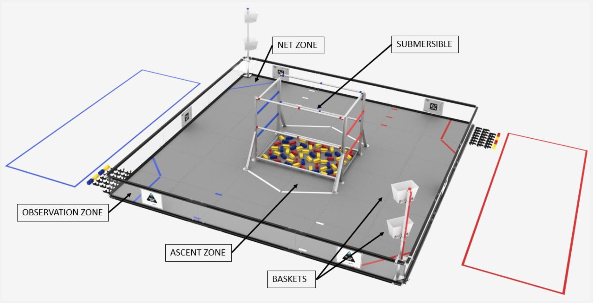
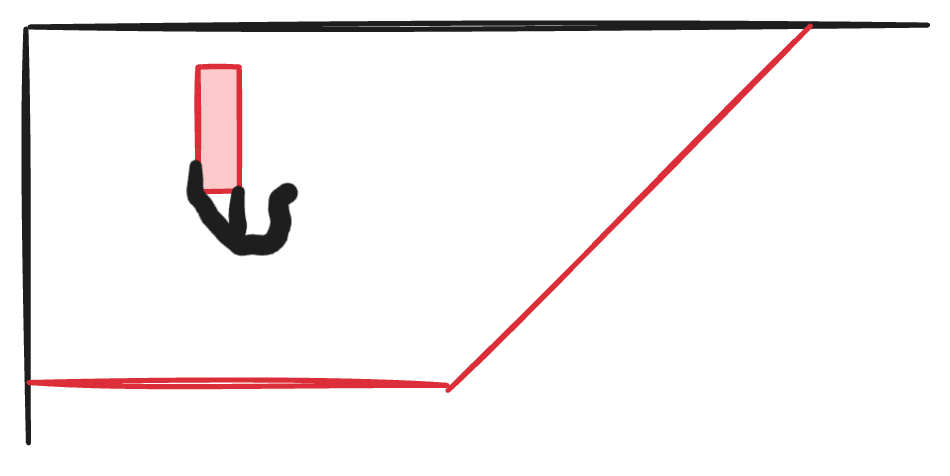
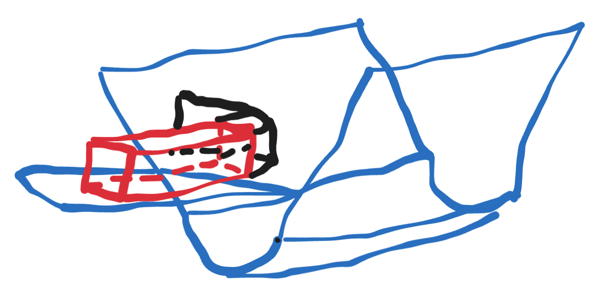
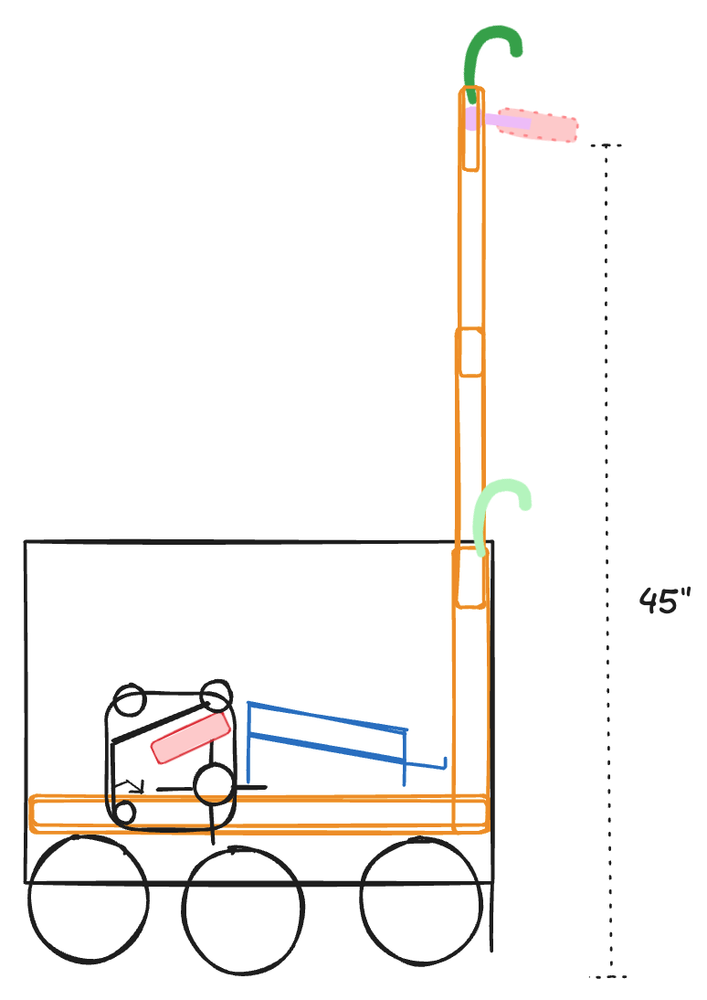
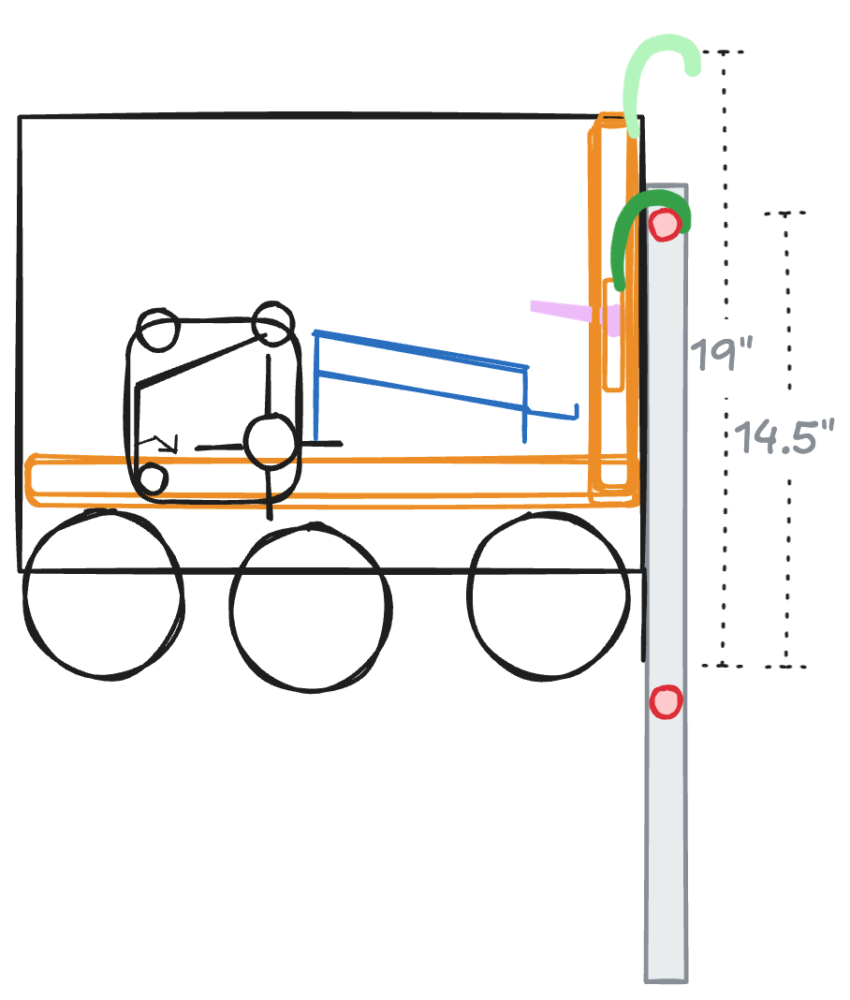

<p align = "center">

</p>
<p align = "center">
Field setup for 2024-2025 FTC game.<br>Image credit: FIRST
</p>

I made one of these halfway through the season [last year](https://atwang16.github.io/post/20240119/), so I wanted to do it again this year! If you have never heard of FIRST Tech Challenge before, I encourage you to check out [their website](https://www.firstinspires.org) to learn more about their suite of four programs.

(Lastly, if on the slight off chance you happen to be a team and see this, I encourage you to try your own design and strategy process first before comparing notes! You are welcome to use this resource, but please cite appropriately and ultimately make sure that you learn *why* you are making your strategy and design decisions.)

# 2023-2024 Retrospective

I didn't follow the competition too closely beyond the tournaments in BC, but watching the finals matches in Houston and based on what I saw at regionals, here are some of my thoughts on my strategy and design thoughts looking back:
* The maximum 2-robot score I computed was 496 points. The maximum pre-penalty score achieved during the grand finals at worlds was 396, with pretty consistent high scores between 350 and 400. I think all of the true scores for each of autonomous, tele-op, and end game were about 80% off from the total. I unfortunately did not predict a reasonable best score, so while my maximum score is pretty consistent with the world final scores, there's not too much other insight we can extract.
* Strategy-wise, I think nearly all of my observations were fairly on point in terms of point priorities and must-haves to be a competitive robot at the top levels. Being able to consistently score the drone and rigging are effectively non-negotiables, but pixel scoring is what will make the difference. Mosaic and height scoring on the backstage seemed like it was maybe difficult to pull off consistently but were present in the top teams—my guess is that it was a matter largely of coordination that made it difficult.
* The top teams could score close to 40 pixels, which between two teams across autonomous and tele-op meant around 20 cycles. My estimate of 24 was a bit over, but I imagine that maybe teams would have been closer without robot interference.
* In terms of winning mechanisms, most everything was pretty on point, though I'm not sure if any teams tried a passive hang this year. The only revision I might make to my design was the pixel scorer. There were robots in the world finals that used effectively the concept I was thinking of, but in retrospect I would actually consider a simpler design for a first iteration. I think it just depends on how much testing and prototyping a team is able to do and what kinds of skills/resources they have at their disposal. It is only a good design if it can be executed correctly, given the downsides of the complexity of the mechanism.

All in all, I think my predictions were pretty solid for not having a field, although I don't think there were any major surprises in the game or large variations in strategy. This year, I'll try to give some hot takes at the end just to see if any of them come true. 🙃

# 2024-2025 Kickoff!

Before I talk about game analysis, I got to go to my first FTC kickoff since 2015 (actually, I don't remember if I even went to the kickoff in 2015 lol)! I got the opportunity to run a workshop on judging and the changes to awards, judging, and advancement for this season. It was a fun experience for me, especially because I feel like I've been waiting 5 years for an opportunity to finally share a bit of my heart and hope for the students now going through the program. Ideally by the time I post this, the link to the workshop recordings will be here, but regardless I hope this won't be the last opportunity I get! I have so many stories to share hahaha, and I think there is a lot of potential for growth for the program and raising a new generation of students in STEM.

# Game Analysis

The first step is to understand the game! You can watch the animated video for this season below!

<p align = "center">
<iframe width="560" height="315" src="https://youtu.be/ewlDPvRK4U4" title="YouTube video player" frameborder="0" allow="accelerometer; clipboard-write; encrypted-media; gyroscope; picture-in-picture; web-share" allowfullscreen></iframe>
</p>

The main components here are to understand the scoring and rules so we can formulate a strategy and parameters for our design.

## Scoring

FIRST conveniently provides a nice scoring summary in their manual, which I have summarized and augmented below. Our goal is to calculate an absolute maximum score (excluding penalties), a reasonable maximum score, and a reasonable good score.

| Task     | Zone             | AUTO | TELEOP | Quantity | Max     |
|----------|------------------|------|--------|----------|---------|
| Park     | Observation Zone | 3    | 3      | 1 / 2    | 3 / 6   |
| Sample   | Net Zone         | 2    | 2      | 60       | 120     |
| Sample   | Low Basket       | 4    | 4      | 60       | 240     |
| Sample   | High Basket      | 8    | 8      | 60       | 480     |
| Specimen | Low Chamber      | 6    | 6      | 20       | 120     |
| Specimen | High Chamber     | 10   | 10     | 20       | 200     |
| Ascent   | Level 1          | 3    | 3      | 1 / 2    | 3 / 6   |
| Ascent   | Level 2          |      | 15     | 1 / 2    | 15 / 30 |
| Ascent   | Level 3          |      | 30     | 1 / 2    | 30 / 60 |

The maximum score we can obtain with 1 robot is **997**, and the maximum score with 2 robots is **1030**, making the following assumptions:
* Each robot gets to preload one sample or specimen. Thus at most one specimen can be scored in autonomous, and the remaining samples scored in autonomous would have to be in the net zone, low, or high basket.
* It is always more optimal to score a specimen in the high basket in autonomous than to save it for tele-op.
assuming you can double score all samples in autonomous and tele-op.
* This leaves a parking and ascent score of 33 or 66 for 1 or 2 robots, respectively, and a sample/specimen score of `1*20 + 59*16 = 964`.
* While the opposing alliance's samples do score in our net zone or baskets, since our robot cannot control them, we will not expect any of them to contribute to our score.

The reasonable maximum we expect is **557** for one robot and **600** for two.
* The chambers and baskets are both limited physically in how many specimens or samples could be scored, ignoring precariously supported scoring elements.
  * The length of the chamber (26.5", with a 1.5"-width specimen) dictates that a team could practically score no more than 17 in a single chamber. That yields a maximum score here of `16*10+1*20=180`, since one of those could be scored autonomously. In the case of two robots, you could get a maximum of `190`.
  * The diagonal height of the basket is 6", and the starting base size is around 3.5" x 6.9". That means that roughly 2 samples could be stacked vertically in a roughly 2 x 4 grid, assuming they are all stored vertically in the basket. This implies around 16 could be stored in each basket. In practice, I think one could do better than that, since it there may be some additional gaps, and samples could actually be feasibly supported on top of each othe without being contained within the basket. Let's say that, in practice, you could store 20 at best in each basket. Teams should actually test this and see what the true maximum is here, at both optimal packing and random packing.
* We assume each alliance has a max score including roughly half of the neutral samples, so the maximum number of samples is 20 alliance-specific ones and 20 neutral ones, of which only the allliance-specific ones can be scored as specimen. Based on how we computed the above, 17 of the alliance-specific samples would be scored on the chamber, 20 would be scored in the high basket, and the remaining 3 could be scored in the low basket (optimal for auto+teleop).

Lastly, the resonable best score we expect is **261** for one robot and **424** for two.
* We are going to assume an 8 second cycle per sample in the high basket (might be generous, depending on robot interference) and 5+5 second cycle per specimen in the high chamber, round trip. That implies the following:
  * During autonomous, we expect to be able to score the specimen in the high chamber. Since there are six spike marks on the ground, the best robots may be able to score all 6, for a total of `61` points for one robot and `74` for two, assuming that in the 2-robot case, only one robot can cycle samples into the high basket, but both can score their specimens and park.
    * Note: because there are three samples on spike marks at the start of the match, it is actually quite possible that the best robots could score all 6 in the high basket during autonomous.
  * During teleop, we expect the ascent at the end to take 5 seconds for the very best robots. Thus, each robot could likely cycle 11 specimen to the high chamber (including human player time) or 14 specimen to the high basket. Since neither of these numbers exceeds the maximum physical limits, we compute 110 points from the high chamber and 112 from the high basket. How exactly these numbers work out depend significantly on the cycle times for each, possible robot interference, and other factors, but we can say that one robot would score 112 points here, and two would score 222 points. We also get the carry-over score of 34 or 44 points from autonomous.
  * The ascent score is assumed to be level 3, for `30` points for one robot and `60` for two.

Some observations from the scoring:
* In general, scoring is simpler this year compared to previous games. Most of the score is based on end state, and there aren't really significant tasks that are different in autonomous or end game as opposed to tele-op. Unless robots play interference, there also aren't a lot of overlapping areas where robots will traverse, collect scoring elements, or score, so I think it is reasonable to assume that this game will be more of a skill challenge than a strategic game. The main "strategic" decision will be to decide whether to prioritize high basket or specimen scoring, as it really depends on cycle times for each.
* As with last year, at the highest levels, performing a level 3 ascent is a non-negotiable, and strategically a good ascent will take a short enough time that it is always better to prioritize it over scoring a sample or specimen.
* Autonomous scoring will be an important tiebreaker. Note that every autonomously score sample/specimen will effectively require the opposing alliance to score an extra sample/specimen over your alliance.
  * Note that, in general, it is better to prioritize sample scoring than parking in the observation zone or perfomring the level 1 ascend.
* Being able to score in either of the chambers will be important, primarily the high chamber. However, if it is possible to completely fill it within a match, then scoring in the low chamber will also become important.
* Because of the space constraints and routing (a large central obstacle means that most robots will be navigating around it), it will likely be most optimal if one robot focuses on specimen scoring and the other focuses on high basket scoring. However, this may not work as an optimal strategy in earlier competitions, when most robots won't be able to do either. As long as it does not compromise long-term strategy and design, it may be optimal to focus on bieng able to perform one of the two tasks well for early game than to do both at first but do a mediocre job.
* The only way to achieve a 5+5 cycle time for specimens is to not have to wait for the human player to attach the clip to the sample. In that case, the human player should be attaching the clip while the robot is scoring the previously prepared specimen.
* There are some numbers that are unproven here. These include the maximum number of scorable elements and the cycle times. I am hazarding guesses based on rough geometric calculations and mental simulations, but in practice, you can do much better by trying this out on a real field with physical simulations.
* The clip should be attached to the end of the sample to maximize space.

## Field Dimensions

Important field dimensions:
* The low chamber is 13" high. This is also fairly close to the height of the perimeter walls (approx. 12.125").
* The low rung is around 20" high, just higher than the height of the robot.
* The low basket is at 25.75", which is roughly the height of the high chamber (26").
* The high basket is around 43" high, which is similar to the height of the high rung (44.5").
* The distance between the low and high rungs is 16" from top to top (15" gap in the middle), which is relevant for achieving a successful level 3 ascent.
* The barriers containing the submersible zone are 2" high.
* The submersible zone is 27.5" x 42.75" in size.

Important quantities (some repeated):
* Number of specimens scorable in each chamber: 17
* Number of samples that will fit in a basket: 20

It is also worth noting that all of the structures are completely vertical, so no angled lift is strictly required.

Not as a dimension, but the other thing I would test here is how much force is required (qualitatively or quantitatively) to score a specimen. Especially if the clips are new, if they don't attach easily to the specimen (and particularly if the force required to attach the specimen is greater than that required to remove the clip from the sample), the robot might need to be designed to apply force to the clip rather than to the sample.

## Rules

These are the main rules that I think will significantly affect strategy and robot design:
* G404: **No AUTO opponent interference**. This is the same as in past years, but it is important to remember this for autonomous planning.
* G410: **1 SAMPLE or SPECIMEN at a time.**
* G411: **ROBOTS may not CONTROL the opposing ALLIANCE’S SPECIFIC SAMPLES or SPECIMENS.** This is important given the randomized nature of samples in the submersible zone, which may make it hard to intake the correct samples.
* G417: **Stay in CONTROL of your SCORING ELEMENTS.** No launching samples. :(
* G418: **Horizontal expansion limit.** - The allowed dimensions are 20" x 42", which is slightly smaller than two tiles. This will limit strategies that allow the robot to extend horizontally on both sides.
  * Note that the furthest extension outside of the robot is limited by 24".
* G420: **No climbing on the inside.** The robot must start the climb on the outside of the submersible zone.

In terms of shaping design, G410, G418, and G420 will likely be the most consequential.

Note that, according to the rules, it is not entirely clear whether grappling hooks would be allowed for the purposes of lifting (i.e. a cable with a hook at the end), so this should be verified in the Q&A.

# Strategy

## Plan and Function

The overall plan for the robot will be fairly straightforward:
* Autonomous: score the specimen and then score as many samples as possible. Perform the level 1 ascend if possible.
* Tele-op: score samples in the high basket or the high chamber.
  * The tradeoff for scoring depends primarily on the alliance partner and secondarily on the cycle time, relative to the score per sample/specimen.
* Endgame: perform the level 3 ascend. Assuming reasonable cycle times, this should be prioritized over sample/specimen scoring.

Thus, the robot should be able to perform the following tasks:
* Navigation
  * **Required**: navigate around the field per driver-controlled instructions
    * Note that being able to translate and spin might be useful, but strafing in general is not beneficial.
  * **Required**: navigate to spike marks autonomously (on eitehr side of field)
  * **Required**: autonomously navigate to chamber side
  * **Required**: autonomously navigate to ascent zone
  * **Required**: autonomously navigate to observation zone
  * **Required**: autonomously navigate to net zone
  * Optional: driving into the submersible zone
* Identification
  * **Ideal**: autonomously identify correctly colored samples.
  * **Ideal**: autonomously align to basket (vertically)
  * **Ideal**: autonomously align to chamber (vertically)
* Sample collection
  * **Required**: collect a sample from the ground
  * **Required**: collect a sample in the submersible zone from outside (ideal: reach should be at least 21.375")
  * **Required**: collect a specimen from the ground
  * **Optional**: collect a specimen from the wall
* Specimen scoring
  * **Required**: release a sample on the ground
  * **Required**: move specimen to height of high chamber autonomously (26")
  * **Required**: move specimen to height of low chamber autonomously (13")
  * **Required**: score specimen by tele-op
  * **Required**: score specimen autonomously
* Sample scoring
  * **Required**: move sample to height of high basket autonomously (>43")
  * **Required**: move sample to height of low basket autonomously (>25.75")
  * **Required**: release sample into basket
* Ascent
  * **Required**: reach low rung (20")
  * **Required**: raise to be fully supported by low rung
  * **Required**: raise to attach to high rung (36")
  * **Required**: raise to be fully supported by high rung and above low rung
  * **Ideal**: perform each step of ascent sequence autonomously

There isn't anything too complicated about our strategy, except that our goal is to automate as many parts of the game as possible, especially sample and specimen scoring.

## Robot Requirements

**Sample scoring**
* Having a touch-and-control intake is important, as collecting samples will probably take the longest.
* Since it is critical to not control an opposing alliance's sample, the intake mechanism should ideally be as automated as possible, given likely obstructions.
* The delivery mechanism should be as fast as possible, with the moving mechanism as light as possible. While we cannot launch samples, we should be moving our lift fast enough to make that time negligible.
* The intake mechanism and delivery mechanism (for samples or specimens) should not be the same. This allows the robot to be able to retract the delivery mechanism while intaking the next sample.
* It may or may not be important to dispense the sample into the basket in a particular orientation. Horizontal dipsensing may optimize for minimal precision and maximal packing.

**Specimen scoring**
* The intake or delivery mechanism should be able to release a sample from not too far a height into the observation zone without requiring the robot to spin around
* In an ideal world, the delivery mechanism could be identical between the samples and specimens, though this is not required
* Intaking specimens (post deploy) should be relatively robust to the orientation (or at least be able to collect it in the most stable position possible)
* Scoring the specimens should involve as few degrees as possible. Ideally, only robot movement and approximate vertical alignment are required.

**Ascent**
* In order to make an ascent worthwhile, the robot must be able to complete...
  * a level 3 ascent faster than completing a level 2 ascent plus scoring a sample and specimen or two samples in the high chamber
  * a level 2 ascent faster than parking and 12 points worth of samples and specimen (e.g. specimen + sample in net zone, or one sample in low basket and one in the high basket)
* If we repurpose part of the delivery mechanism for the ascent, then the low rung hang can be fairly minimal (only needs to raise approx. 1").
* To minimize alignment challenges going from the level 2 to 3 ascent, the hooking mechanism should have as few DOFs as possible to attach the hook.

# Robot Design

The below is my hypothesis for what could be a winning design and the design I would build. Because I don't have the resources to prototype anything, everything here is purely my brainchild of what works in my mental simulation. The likelihood that every mechanism works as imagined is pretty low most likely, but it will be interesting to see if anyone tries similar ideas.

## Drivetrain and chassis

Since we don't need precise horizontal movement or particularly good ground clearance, we opt for a fairly simple 6-wheel drive. The only real benefit an omnidirectional drive would provide is probably collecting spike marks during autonomous, but with efficient driving (turning while moving), the benefit should be negligible. Reducing weight (and keeping it low) will be important, hence simple drives are better than more complex ones. Being able to drive over samples will likely be beneficial to avoid any risk of controlling more than one at a time. While we don't anticipate significant robot interference, this may be a useful game to have some amount of pushing power in case any team tries such a strategy.

```
DC motors required: 4
```

## Sample Intake

As usual, there are a lot of different designs that could work well for a touch-and-control intake, and the only real way to find the best one is to test. The main criteria are the following:
* needs to be able to reach and fold out over the 2" barrier.
* needs to be able to collect a sample in any horizontal orientation
* needs to be able to collect a specimen in any orientation

Because we need to extend a DC motor for the intake out horizontally, we should at least make sure that it is chained/belted such that the DC motor itself does not need to rotate, i.e. the intake hopper should be as light as possible to make rotation possible with a robust servo motor. To support the intake mechanism, a small omniwheel may be placed at the end so that it can be supported by the ground.

The designs which I would likely prototype include
* Wheels (vertical and horizontal)
* Surgical tubing (or equivalent)

The main downsides of a wheel design are the clip, which might obstruct the intake, and the non-cube shape of the sample. Additionally, because the samples are concave on all sides, the wheels will need to be wide enough to engage on the edges. On the other hand, the control ability of wheels can usually be better compared to tubing as an intake, though the concave areas of the samples may actually make it easier to grip the samples (albeit with some potential flipping).

In the case of specimens, we need to be able to score it with the long axis of the sample parallel to the forward/reverse direction of the robot, so that the clip opening faces the front of the robot. Thus, we need a mechanism which will ensure that

1. the samples are rotated to align the axis, and
2. to move the clip so that the opening is either on the top or bottom of the sample.

For our design, we will propose to use an overhead intake (wheels or surgical tubing mostly irrelevant). The human player will be instructed to place specimens so that the clip is furthest from the wall (as shown):

<p align = "center">

</p>
<p align = "center">
Orientation of specimen relative to wall (black). The clip could technically have the opening to the right or left.
</p>

Upon collecting the specimen, it will be deposited onto a funnel ramp which will cause the clip to re-orient facing up. There is a risk that this would in some cases cause the clip to face downward, depending on how it funnels in. This will need to be further validated in testing.

<p align = "center">

</p>
<p align = "center">
Concept idea for a ramp which would auto-orient the clip upward. A stopper at the end should hold the specimen 
</p>

The sample or specimen will then sit at the end of the ramp until collected by the gripper (see delivery mechanism).

```
DC motors required: 2
Servo motors required: 1
```

## Delivery Mechanism

The delivery mechanism will be a simple 4-stage telescopic lift. The lift should only raise the hopper for samples with a servo for controlling the release of the sample (we could consider a passive release mechanism triggered by pushing against the basket, but this may be a bit volatile). the ascent mechanism should be mounted on the lift but not require any sort of motor control to activate (to reduce motor weight on the lift). Depending on the stackability of samples in the high basket, it could be useful to allow the lift to raise samples even higher than 45" (43" needed to clear the near edge of the basket). We choose to power the lift with two motors for speed of operation and power during ascent (see ascent mechanism).

The scoring mechanism for the samples and specimens involves a simple 2-motor rotating grasper (rotational axis points left/right). The main constraint is that the scoring mechanism needs to hold the specimen just outside of the robot, hence using a rotating arm. Note that this will flip the clip so that it is upside down. The grasper can then activate to release the sample or specimen as appropriate. The goal here is to have the sample stick out just far enough without making the gripper unnecessarily long.

<p align = "center">

</p>
<p align = "center">
The delivery mechanism raises the sample to a height of ~45" using a telescoping lift, which is sufficient to clear the high basket height of 43". The gripper (light violet) rotates back and forth to grab the sample and score it. The clip, not shown, would have its opening facing forward, underneath the sample. Since the height of the high chamber is only 26", this lift would be more than sufficient to reach it.
</p>

```
DC motors required: 2
Servo motors required: 2
```

## Ascent Mechanism

The most challenging part of the ascent is managing the robot's supports and center of mass. Because the robot is starting the climb outside of the submersible zone, the rungs are all guaranteed not above the CoM, which means that once the robot is no longer leaning against the side, it will begin to rotate. This is likely the idea that will need the most prototyping and refining, due to the physics involved.

We propose the following solution:
1. Spring-loaded hooks (A) can be activated by the robot on the front of the robot using a servo.
2. Hooks attached to the lift allow the robot to lift itself high enough to engage the spring-loaded hooks.
3. The lift then subsequently raises up to engage the high rung. While pulling the robot up to the high rung and until the low rung is cleared, the robot should always be in contact with the low rung
4. Once the robot raises above the diagonal support of the submersible, a side support should be engaged to push against either side of the submersible, so that the robot does not rotate as it is lifting. This must be done before the 

<p align = "center">

</p>
<p align = "center">
Robot with a completed ascent. The low and high rungs are shown in red. The robot does not rotate because it is leaning against the side structure.
</p>

In this case, we can dedicate two DC motors to the ascent mechanism. Some notes for execution:
* Designing reliable spring-loaded hooks are the crux of the design. These hooks should be able to bend back toward the robot when contacting an object above them, but they should snap back into vertical position without any obstruction.
* EITHER the robot must not raise itself in step 2 above about 1", OR the side support needs to be able to trigger before raising above the diagonal support and be able to spring-load downward in order to clear it.
* The final position of the hooks must cause the bottom of the robot to clear the low rung, meaning that the distance between the hook and the bottom of the robot must be <14.5". That means that we would not be able to repurpose the original stationary hooks for the final lift. Care should be taken to ensure that the robot does not strain the motors after the end of the match, should the robot want to backdrive the motors. This could be resolved by a third set of hooks at the requisite height, though that may complicate the mechanism further.

The main challenges of this design are that the robot can only lift itself near the edge, making alignment more challenging, and that the lift design must be solid enough to be used both for fast delivery and a robust ascent. However, it seems to be the most effective design in terms of conserving motors (unless we use motors for multiple purposes) and preserving the orientation of the robot. This also assumes that the definition of "supported by" allows for leaning against the side structure.

Alternative ideas:
* Rather than have the robot remain constantly upright, the robot could turn to face up once the low rung is cleared. The  main challenge is that the robot would have to clear the 14.5" by length, which is actually quite difficult since the robot needs to rotate 90° to clear the low rung—even if the length were 14.5", the diagonal would be `14.5" x sqrt(2) = 20.5"`. This would remove the need for the side supports and make it easier to hang without fear of backdriving, but it would be hard to fully clear the low rung and also add extra distance traveled and thus time to complete the ascent. This would require more testing, since it is hard for me to predict how much power would actually be required to perform either of these solutions, given system inefficiencies.
* A winch design can always result in a cleaner and more reliable lift, but it would require the robot to re-orient itself and suffer from potentially not having enough motors for every component (given only two DC motors, you would need to still use 1 motor on the lift to raise the robot and also use 1 motor on the winch, which may result in both functions not performing very well). If one could find an optimal way to distribute or repurpose motors, this could be a more effective design than using the lift.
* To resolve the weight distribution issues, could be to mount the lift on the opposite side of the robot. Because we can extend the intake out, technically it could be used to try to force the CoM to be under the bar, but it would make the ascent a bit more complicated.

```
DC motors required: 2 (same as delivery mechanism)
Servo motors required: 2
```

# Concluding Thoughts

Honestly, most of this design is pretty standard relative to past designs. The most unique challenges I think are the following:
* Intaking specimens is hard because of the clip adding an unusual shape to the sample. Being able to still collect these quickly is useful (avoid claws ideally).
* Positioning the specimen for scoring so you can effectively just run into the bar and then retreat.
* Performing the ascent is probably the most technically challenging component of this game, since the robot needs to fully clear the low rung to complete a level 3 ascent. Given that, early designs might focus on just completing a successful level 2 ascent and using the time to score extra samples (remember, the level 2 to 3 ascent time must be shorter than that of scoring two additional samples in the high basket for it to be worth it).

Now for some guesses as to what will happen in the season as well as some hot takes (?):
* Control fouls will be common in the submersible zone, due to the difficulty of seeing which one is which while collecting.
* Human player penalties will be common in the qualifying tournaments.
* At the qualifying tournaments I attend, only two teams will be able to pull off level 3 ascents with any consistent level of success (not sure which two yet).
* The BC regional championship elimination matches will have at least one match with all four robots ascending to level 3.
* A robot will fall off the rung while completing an ascent during the BC regional elimination matches, and it will be very sad.
* By worlds, teams will be completely filling the high basket.
* No match, including at worlds, will end with all samples scored.
* No alliance in BC regional elimination matches or worlds finals will end up scoring the max 17 specimens on the high rung.
* The world record by the end of the season will reach 424 points.

Finally, my ranking of the game: I'll admit that when I first saw the game, I thought it was kinda boring. After studying it a bit more, I've come around a bit 😅. I'm going to publish a subsequent blog post with my tier list of all FTC games, but I would say tentatively that my pre-season rating is B tier. There are some elements which are actually more interesting than I thought they would be, and I'm excited to see if that holds true in the actual games!

If any of this piques your interest, then consider finding a school or local team to compete in (if you are in middle or high school), or sign up to volunteer or find a team to mentor! I have seen myself how much fun the students have and how much they learn through the program, and even if you do not have a technical background, you can probably still bless the kids so much with your talents. Feel free to reach out if you are not sure how to get involved.
